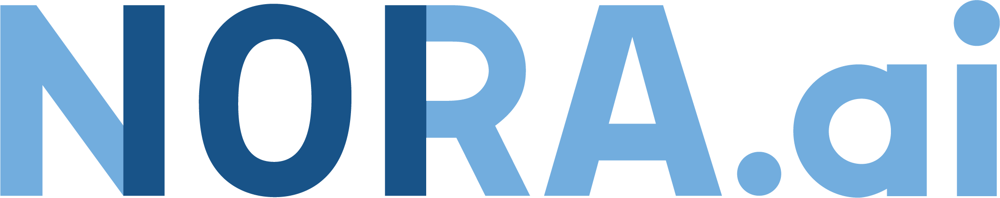

# NORA.ai Cutting-edge AI Seminars

Welcome to the [NORA.ai](https://nora.ai) Cutting-edge AI seminar series repository. Our goal is to democratize AI by providing an accessible platform for individuals to gain knowledge, exchange ideas, and collaborate on projects related to AI. Our quarterly event series will feature experts in the field sharing their knowledge and insights on the latest advancements in AI. Here, you will find all the resources from our events including scripts, videos, and presentations. Join us in our mission to make cutting-edge AI accessible to all by following our repository and attending our seminar series.

## Upcoming events

| Date | Topic | Location | Link |
|:--------------|:------|:--------|:--------|
| [11 May 2023](https://github.com/NORA-Norwegian-AI-Research-Consortium/Cutting-edge-AI-Events/blob/main/11%20May%2023/) | TBA | Domus Bibliotheca | [Register here](https://www.nora.ai/events/cuttingedgeai.html) |

## Past events

| Date | Topic | Location | 
|:--------------|:------|:--------|
| [21 February 2023](https://github.com/NORA-Norwegian-AI-Research-Consortium/Cutting-edge-AI-Events/blob/main/21%20Feb%2023%20-%20Seminar%201%3A%20Large%20Language%20Models/) | Large Language Models | Domus Bibliotheca | 

## Discussion

You have questions? Join our community discussions in the 'Discussions' tab, share your thoughts and give feedback on the events.

## License

This repository is licensed under the [MIT License](LICENSE) unless otherwise specified in the individual files.

## Contact

For any questions, please contact us at contact@nora.ai.